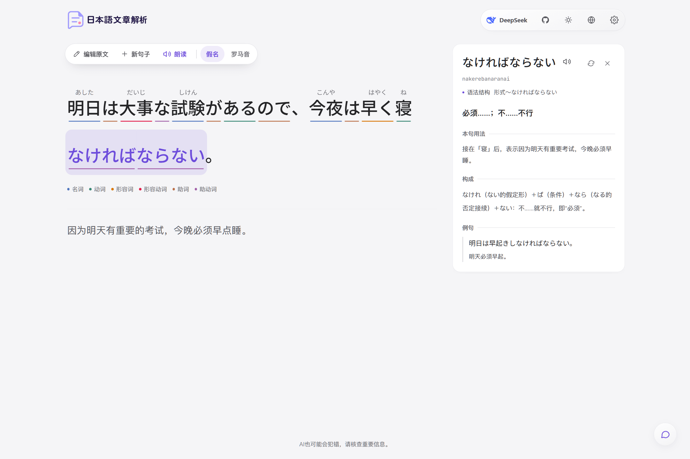
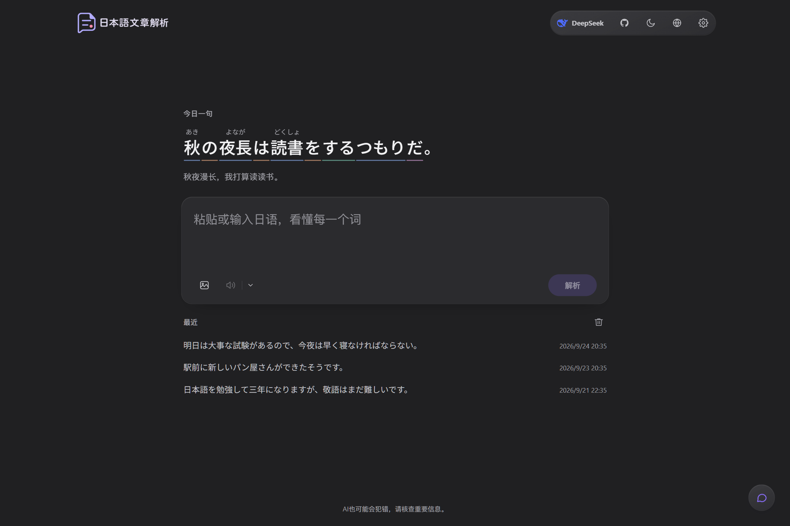
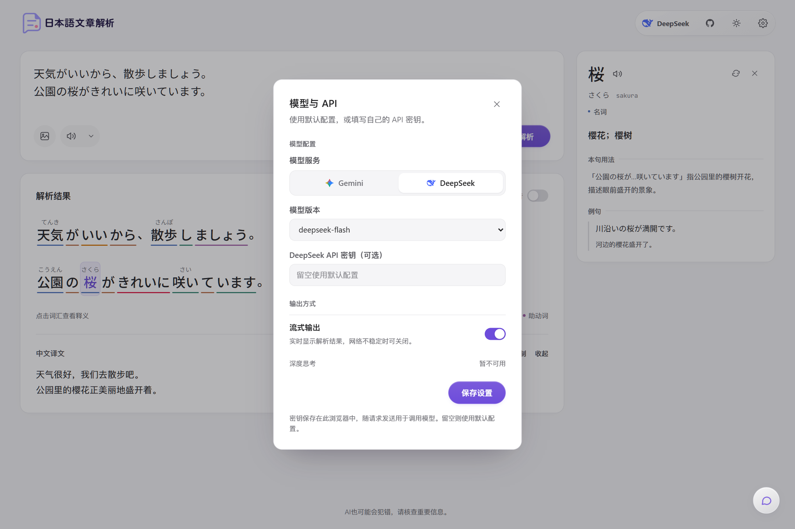
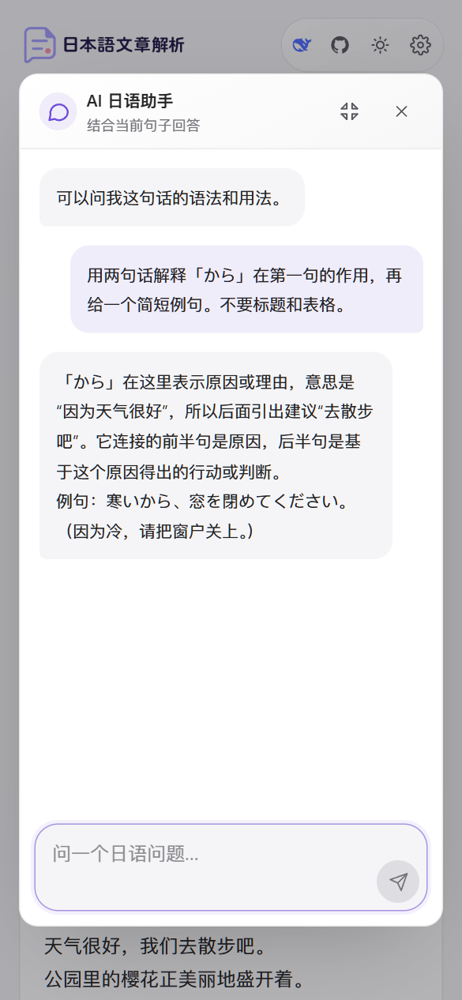

# Japanese Sentence Analyzer

🌐 [简体中文](README.md) | [繁體中文](README.zh-TW.md) | [English](README.en.md) | [한국어](README.ko.md) | [日本語](README.ja.md)

A Japanese learning tool with Simplified Chinese, Traditional Chinese, English, and Korean interfaces. Analyze Japanese sentences, look up vocabulary in context, translate passages, extract text from images, and practice with an AI assistant.

[Live demo](https://nihongodemo.howen.ink/) · [Online documentation](https://doc.howen.ink/)

<p align="center">
  
</p>

## Screenshots

The screenshots show the Simplified Chinese interface. Use the globe icon to change the language in the app.





<p align="center">
  
</p>

## Features

- **Language selection:** use the globe icon in the top-right toolbar to choose 简体中文, 繁體中文, English, or 한국어. The browser remembers your choice. Interface text, translations, vocabulary explanations, and new AI replies use the selected language. Traditional Chinese uses natural vocabulary and phrasing, rather than character conversion alone.
- **Japanese analysis:** word segmentation based on Japanese school grammar, part-of-speech labels, kana readings, and locally generated romaji. Japanese source text and readings remain Japanese in every interface language.
- **Vocabulary in context:** click a word for its meaning, dictionary form, conjugation, grammatical role, and examples with translations.
- **Passage translation:** preserve paragraphs and line breaks; changing the language refreshes the translation. Existing chat messages keep their original language.
- **Plain-text paste:** remove rich-text styling, Markdown formatting, and link destinations while retaining visible link labels and paragraph breaks. Bare web addresses are removed. Pasting an image still starts OCR.
- **Long passages and links:** analyze long passages in chunks. URLs that remain in the input are preserved locally instead of asking the model to reproduce long encoded addresses; incomplete output is still rejected.
- **Image OCR:** upload or paste an image to extract Japanese text using the selected provider.
- **Read aloud:** choose Edge TTS or Gemini TTS. The voice settings menu opens below its button.
- **AI Japanese assistant:** ask about grammar, vocabulary, culture, study methods, and the current sentence.
- **Provider settings:** switch between DeepSeek and Gemini, choose streaming output, and optionally save a separate API key for each provider in your browser.
- Light, dark, and system themes; optional access password and Umami analytics; Vercel and Docker deployment.

## Models

These are the model identifiers configured in this repository.

| Capability | Model / service | Behavior |
| --- | --- | --- |
| Default text provider | DeepSeek `deepseek-flash` | Thinking is disabled; its toggle is currently unavailable in Settings. |
| Gemini text processing | `gemini-flash-latest` / `gemini-flash-lite-latest` | Select Flash or Flash-Lite in Settings; reasoning levels are Low and Minimal respectively. |
| Image OCR | `deepseek-flash` / selected Gemini model | DeepSeek OCR uses the same model as text analysis, with thinking disabled. |
| Speech | Edge TTS / `gemini-3.1-flash-tts-preview` | Edge TTS is the default. Gemini TTS requires a Gemini API key. |

## Quick start

Use Node.js 22, matching the Docker image.

```bash
git clone https://github.com/cokice/japanese-analyzer.git
cd japanese-analyzer
npm ci
cp .env.example .env.local
```

On Windows PowerShell, replace the last command with `Copy-Item .env.example .env.local`.

Set `DEEPSEEK_API_KEY` in `.env.local` to use the default provider. Add `GEMINI_API_KEY` if you want Gemini text processing, OCR, or TTS. Leave endpoint variables empty to use their built-in defaults.

```env
DEEPSEEK_API_KEY=your_deepseek_api_key
DEEPSEEK_API_URL=
GEMINI_API_KEY=
GEMINI_API_URL=
CODE=
NEXT_PUBLIC_UMAMI_SRC=
NEXT_PUBLIC_UMAMI_WEBSITE_ID=
```

```bash
npm run dev
```

Open [http://127.0.0.1:3000](http://127.0.0.1:3000). For testing from another device on your local network:

```bash
npm run dev -- --hostname 0.0.0.0 --port 3100
```

Open `http://<your-computer-LAN-IP>:3100` on that device.

## Environment variables

| Variable | Purpose |
| --- | --- |
| `DEEPSEEK_API_KEY` | Server-side default key for DeepSeek text processing and OCR. |
| `DEEPSEEK_API_URL` | Optional OpenAI-compatible endpoint. Default: `https://api.deepseek.com/chat/completions`. |
| `GEMINI_API_KEY` | Server-side default key for Gemini text processing, OCR, and TTS. |
| `GEMINI_API_URL` | Optional OpenAI-compatible endpoint. Default: `https://generativelanguage.googleapis.com/v1beta/openai/chat/completions`. |
| `CODE` | Optional access password; leave empty to disable the login prompt. |
| `NEXT_PUBLIC_UMAMI_SRC` | Optional Umami script URL, such as `https://cloud.umami.is/script.js`. |
| `NEXT_PUBLIC_UMAMI_WEBSITE_ID` | Umami website ID. Analytics load only when both Umami variables are set. |

Server-side keys are not exposed to the frontend. Users can alternatively enter their own keys in the top-right Settings menu: these are stored in that browser and sent to this app's server when making API requests. Provider endpoints are configured on the server. Gemini TTS uses a separate official speech endpoint and is unaffected by `GEMINI_API_URL`.

Umami reads runtime configuration. It records feature usage, providers, models, streaming mode, request duration, time to first result, and fixed error/cancellation categories. It does not include input text, chat messages or replies, images, translations, raw error messages, or API keys in events. Local environment files are ignored by Git; keep them out of commits.

## Deploy to Vercel

[](https://vercel.com/new/clone?repository-url=https://github.com/cokice/japanese-analyzer)

1. Fork or import the repository into Vercel.
2. Set `DEEPSEEK_API_KEY` under **Settings → Environment Variables** for the default provider.
3. Optionally add `GEMINI_API_KEY`, `CODE`, and both Umami variables.
4. Deploy, or redeploy after changing environment variables.

## Deploy with Docker

The Docker Hub image `howenhowen/japanese-analyzer:latest` supports `linux/amd64` and `linux/arm64`. From the repository root:

```bash
cp .env.production.example .env.production
# Edit .env.production and configure your API keys.
docker compose -f docker-compose.hub.yml up -d
```

On Windows PowerShell, use `Copy-Item .env.production.example .env.production` to copy the template. Both the host and container ports are `3002`. Open `http://<server-IP>:3002`.

Update the image and recreate the container:

```bash
docker compose -f docker-compose.hub.yml pull
docker compose -f docker-compose.hub.yml up -d
docker compose -f docker-compose.hub.yml logs -f
```

For a direct container launch with the same environment file:

```bash
docker run -d --name japanese-analyzer --restart unless-stopped \
  --env-file .env.production -p 3002:3002 \
  howenhowen/japanese-analyzer:latest
```

## Development

```bash
npm run dev          # Development server
npm test             # API, localization, parsing, and paste regression tests
npm run lint         # Repository lint checks
npm run build        # Production build and type validation
npm start            # Serve an existing production build
npx tsc --noEmit     # Type check only
```

## Troubleshooting and contributions

- If analysis fails on a copied article, paste it again to remove formatting and link destinations. For a persistent failure, include the provider, model, interface language, and a reproducible sample in an Issue; omit API keys.
- Language preferences are stored separately in each browser. Use the globe icon to change them; browser translation is not required.
- Report bugs and feature requests through Issues. Pull requests are welcome.

## Acknowledgments and license

Thanks to the [LINUX DO](https://linux.do/) community for its support. Starting with the license-transition commit after `mit-final`, the project as a whole is distributed under the [GNU AGPL v3 only (AGPL-3.0-only)](./LICENSE).

Code previously released under MIT, including `mit-final` (`fb57ddc`), retains its existing MIT grant. See the [legacy MIT license](./LICENSES/MIT-legacy.txt), [licensing and deployment notes](./LICENSING.md), and [copyright notices](./NOTICE).

Commercial use is permitted. When distributing covered works or offering a modified version over a network, provide the corresponding source as required by the license.
