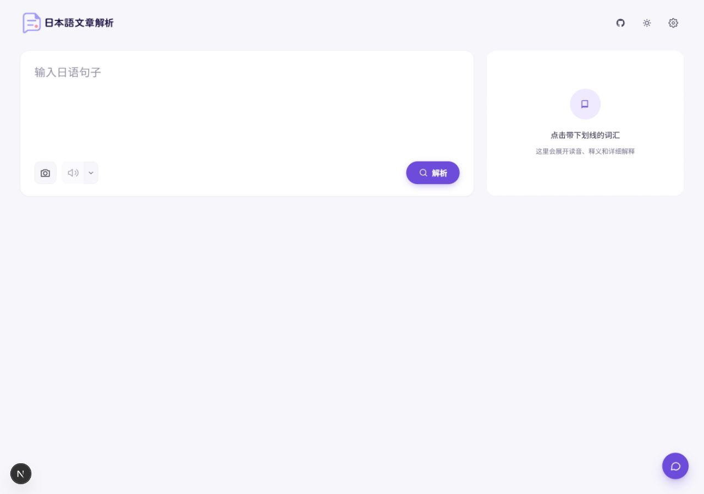
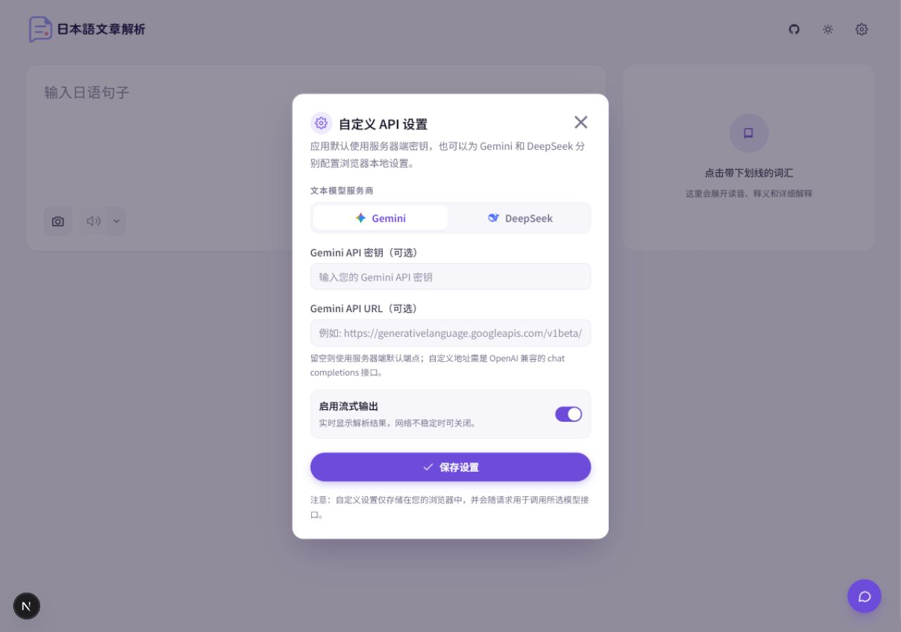
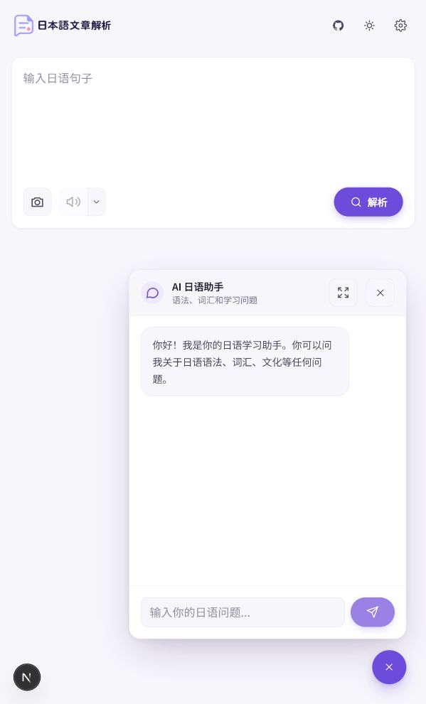

# 日本語文章解析

面向中文学习者的日语句子解析工具。输入一句日语，应用会拆解词汇、读音、罗马音、词性、整句翻译和单词详解，并提供图片识别、朗读和 AI 日语助手。

体验链接 https://nihongodemo.howen.ink/

<p align="center">
  
</p>

<p align="center">
  <a href="./LICENSE"></a>
  
  
  <a href="https://linux.do/"></a>
</p>

## 界面预览

### 主界面



### 模型与 API 设置



### 移动端 AI 日语助手



## 功能

- 句子解析：分词、假名、罗马音、词性标记和中文释义。
- 单词详解：点击词汇查看读音、释义、语法角色和上下文解释。
- 整句翻译：生成中文整句翻译，方便快速理解语境。
- 图片识别：上传或粘贴图片提取日语文字。当前仅 Gemini 支持。
- 朗读：支持 Edge TTS 和 Gemini TTS。
- AI 日语助手：围绕日语语法、词汇、文化和当前句子提问。
- 双模型服务商：文本模型支持 Gemini 和 DeepSeek，默认使用 DeepSeek。
- 本地浏览器设置：用户可以在设置弹窗中为 Gemini / DeepSeek 分别填入自己的 API Key。
- 可选访问密码：部署后可用 `CODE` 做简单访问控制。
- 可选 Umami 统计：配置环境变量后自动加载 Umami 跟踪脚本。
- Docker 部署：支持 Docker Compose 和 Docker Hub 多架构镜像。

## 模型说明

| 能力 | 默认模型 / 服务 | 说明 |
| --- | --- | --- |
| 文本解析 | `deepseek-v4-flash` | 默认文本服务商是 DeepSeek。 |
| Gemini 文本解析 | `gemini-3.5-flash` | 可在设置中切换到 Gemini。 |
| 图片识别 | Gemini | DeepSeek 当前不支持图片识别，选择 DeepSeek 时图片上传和粘贴识别会关闭。 |
| 朗读 | Edge TTS / Gemini TTS | 默认使用 Edge TTS；Gemini TTS 需要 Gemini API Key。 |

## 快速开始

```bash
git clone https://github.com/cokice/japanese-analyzer.git
cd japanese-analyzer
npm install
```

复制环境变量模板：

```powershell
Copy-Item .env.example .env.local
```

编辑 `.env.local`。如果只想先跑文本解析，建议先配置 DeepSeek：

```env
DEEPSEEK_API_KEY=your_deepseek_api_key
DEEPSEEK_API_URL=https://api.deepseek.com/chat/completions

GEMINI_API_KEY=your_gemini_api_key
GEMINI_API_URL=https://generativelanguage.googleapis.com/v1beta/openai/chat/completions

CODE=

NEXT_PUBLIC_UMAMI_SRC=
NEXT_PUBLIC_UMAMI_WEBSITE_ID=
```

启动开发环境：

```bash
npm run dev
```

打开 `http://127.0.0.1:3000`。

## 环境变量

| 变量 | 必填 | 用途 |
| --- | --- | --- |
| `DEEPSEEK_API_KEY` | 推荐 | DeepSeek API Key。默认文本服务商是 DeepSeek。 |
| `DEEPSEEK_API_URL` | 可选 | DeepSeek OpenAI 兼容接口地址；留空使用官方默认地址。 |
| `GEMINI_API_KEY` | 可选 | Gemini API Key。用于 Gemini 文本解析、图片识别和 Gemini TTS。 |
| `GEMINI_API_URL` | 可选 | Gemini OpenAI 兼容接口地址；留空使用官方默认地址。 |
| `CODE` | 可选 | 访问密码。设置后访问应用需要先输入密码。 |
| `NEXT_PUBLIC_UMAMI_SRC` | 可选 | Umami 脚本地址，例如 `https://cloud.umami.is/script.js`。 |
| `NEXT_PUBLIC_UMAMI_WEBSITE_ID` | 可选 | Umami Website ID。需要和 `NEXT_PUBLIC_UMAMI_SRC` 同时配置才会启用。 |

说明：

- `DEEPSEEK_API_KEY` 和 `GEMINI_API_KEY` 是服务器端默认密钥，不会暴露到前端。
- 用户也可以在右上角设置中填写自己的 Key，设置仅保存在浏览器本地。
- Umami 统计通过本地 loader 读取运行时环境变量；两个 `NEXT_PUBLIC_UMAMI_*` 都为空时不会加载 Umami。
- 启用 Umami 后会记录隐私最小化的使用事件：`analyze_sentence` 只包含解析 `provider` / `model`、是否使用图片识别、图片识别模型、是否使用 TTS、TTS 模型；`image_text_extract`、`tts_speech`、`word_detail_click` 只包含对应功能的 provider/model 元数据。事件不包含输入文本、图片内容、提取结果、词汇内容、翻译结果、错误内容或 API Key。
- 不要提交 `.env.local`，仓库已经默认忽略本地环境变量文件。

### 用 AI Agent 部署(Claude Code / Codex)

如果你使用 Claude Code 或 Codex 等 AI 编程助手,可以直接把下面的提示词发给它,让它在你的 VPS 上完成部署:

````markdown
# 部署任务:japanese-analyzer

请帮我在这台 VPS 上用 Docker 部署 japanese-analyzer(一个日语句子解析 Web 应用)。

## 目标

- 使用 Docker Hub 镜像 `howenhowen/japanese-analyzer:latest`(多架构,amd64/arm64 都有)
- 容器监听 3002,映射宿主机 3002 端口
- 容器名 `japanese-analyzer`,设置 `--restart unless-stopped`

## 环境变量

通过环境变量注入,不要写进镜像:

- `DEEPSEEK_API_KEY`:必填,默认文本解析用 DeepSeek(我会提供,或提示我填入)
- `GEMINI_API_KEY`:可选,用于图片识别和 Gemini TTS,没有就跳过
- `CODE`:可选访问密码,留空即不启用
- `DEEPSEEK_API_URL` / `GEMINI_API_URL`:留空使用官方默认地址即可

推荐用 docker compose 管理:仓库里有 `docker-compose.hub.yml`,配合 `.env.production`(从 `.env.production.example` 复制)使用;或者直接 `docker run` 也行,你看哪个更合适。

## 域名与 HTTPS(询问后再做)

容器跑通后,询问我是否需要绑定域名并配置 HTTPS 反向代理:

- 如果我说不需要,直接用 `http://VPS_IP:3002` 访问即可,跳过本节
- 如果我提供域名(例如 `nihongodemo.howen.ink`):
  - 先检查服务器上是否已有 Nginx / Caddy,优先复用现有的,不要重复装一套
  - 都没有的话推荐 Caddy(自动签发和续期 Let's Encrypt 证书,配置最简单)
  - 反代到 `127.0.0.1:3002`,配置 HTTPS 并把 HTTP 重定向到 HTTPS
  - 提醒我先把域名 A 记录解析到这台 VPS,并确认 80/443 端口在防火墙/安全组已放行
  - 配好后用 `curl -I https://域名` 验证证书和反代是否正常

## 验收标准

1. 容器正常运行,`docker logs` 无报错
2. `curl http://127.0.0.1:3002` 能返回页面
3. 重启服务器后容器能自动拉起
4. (如配置了域名)https 访问正常,证书有效

## 注意

- 如果 3002 端口被占用,先告诉我再换端口,不要擅自杀掉占用进程
- API Key 属于敏感信息,不要 echo 到日志或写入不必要的文件
- 修改现有 Nginx/Caddy 配置前先备份原文件
- 部署完成后告诉我访问地址和后续更新镜像的命令(pull → rm → run 或 compose pull && up -d)
````


## 部署到 Vercel

[](https://vercel.com/new/clone?repository-url=https://github.com/cokice/japanese-analyzer)

部署步骤：

1. Fork 或导入本仓库到 Vercel。
2. 在 Vercel 项目的 `Settings -> Environment Variables` 中配置环境变量。
3. 至少配置 `DEEPSEEK_API_KEY`，这样默认文本解析可以直接使用。
4. 如需图片识别或 Gemini TTS，再配置 `GEMINI_API_KEY`。
5. 如需 Umami 统计，同时配置 `NEXT_PUBLIC_UMAMI_SRC` 和 `NEXT_PUBLIC_UMAMI_WEBSITE_ID`。
6. 重新部署项目。

## Docker 部署

项目提供 Docker Hub 多架构镜像，支持 `linux/amd64` 和 `linux/arm64`。容器默认监听 `3002`，下面示例会把宿主机 `3002` 映射到容器 `3002`。

拉取镜像：

```bash
docker pull howenhowen/japanese-analyzer:latest
```

启动容器：

```bash
docker run -d \
  --name japanese-analyzer \
  --restart unless-stopped \
  -p 3002:3002 \
  -e DEEPSEEK_API_KEY="your_deepseek_api_key" \
  -e GEMINI_API_KEY="your_gemini_api_key" \
  -e CODE="" \
  howenhowen/japanese-analyzer:latest
```

访问：

```text
http://your-vps-ip:3002
```

如果只使用 DeepSeek 文本解析，可以不填 `GEMINI_API_KEY`；如果不需要访问密码，可以保持 `CODE=""`。不需要自定义接口地址时，`DEEPSEEK_API_URL` 和 `GEMINI_API_URL` 也可以不用填，应用会使用默认地址。

如需启用 Umami，启动容器时额外加入：

```bash
  -e NEXT_PUBLIC_UMAMI_SRC="https://cloud.umami.is/script.js" \
  -e NEXT_PUBLIC_UMAMI_WEBSITE_ID="your_umami_website_id" \
```

查看日志：

```bash
docker logs -f japanese-analyzer
```

更新镜像：

```bash
docker pull howenhowen/japanese-analyzer:latest
docker rm -f japanese-analyzer
docker run -d \
  --name japanese-analyzer \
  --restart unless-stopped \
  -p 3002:3002 \
  -e DEEPSEEK_API_KEY="your_deepseek_api_key" \
  -e GEMINI_API_KEY="your_gemini_api_key" \
  -e CODE="" \
  howenhowen/japanese-analyzer:latest
```

也可以用 Docker Compose 管理容器。复制 `.env.production.example` 为 `.env.production` 并填入密钥后执行：

```bash
docker compose -f docker-compose.hub.yml up -d
```

镜像名：

```text
howenhowen/japanese-analyzer:latest
```

## GitHub Actions 自动构建

仓库包含 `.github/workflows/docker.yml`。每次 push 或 pull request 会自动执行：

- `npm ci`
- `npm test`
- `npm run lint`
- `npm run build`
- Docker image build

推送到 `howendev/dev`、仓库默认分支或 `v*` tag 时，如果配置了 Docker Hub secrets，会自动构建并推送多架构镜像。`linux/amd64` 会在 `ubuntu-latest` 上构建，`linux/arm64` 会在 `ubuntu-24.04-arm` 上构建，最后合并成同一组 Docker tag。

分支发布会生成：

```text
howenhowen/japanese-analyzer:latest
howenhowen/japanese-analyzer:<branch>
howenhowen/japanese-analyzer:sha-<commit>
```

版本 tag 发布会生成：

```text
howenhowen/japanese-analyzer:<tag>
howenhowen/japanese-analyzer:sha-<commit>
```

需要在 GitHub 仓库 `Settings -> Secrets and variables -> Actions` 配置：

| Secret | 说明 |
| --- | --- |
| `DOCKERHUB_USERNAME` | Docker Hub 用户名，例如 `howenhowen`。 |
| `DOCKERHUB_TOKEN` | Docker Hub Personal Access Token，不要使用账号密码。 |

运行时密钥不要打进镜像；VPS 仍然通过 `.env.production` 注入 `DEEPSEEK_API_KEY`、`GEMINI_API_KEY`、`CODE`、`NEXT_PUBLIC_UMAMI_SRC`、`NEXT_PUBLIC_UMAMI_WEBSITE_ID` 等变量。

## 开发命令

```bash
npm run dev      # 本地开发
npm test         # 运行 API / provider 配置测试
npm run build    # 生产构建，发布前建议先跑
```

## 项目结构

```text
app/
  api/                 # Next.js API routes
  api/_utils/          # provider 配置与 OpenAI 兼容代理
  components/          # 输入区、解析结果、设置弹窗、AI 助手等组件
  hooks/               # 单词详情和交互逻辑
  services/            # 前端 API 调用与本地设置迁移
docs/images/           # README 截图
tests/                 # 轻量测试
```
## 致谢

- 感谢 [LINUX DO](https://linux.do/) 社区的支持与推广

## 许可证

本项目基于 [MIT License](./LICENSE) 发布。
